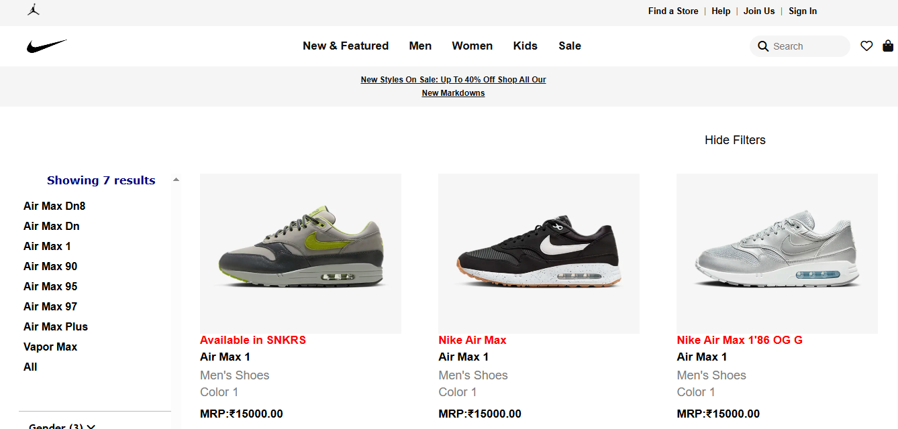

<div align="center">

<sub>Dev-Chandan404 / Nike-Air-Jordan</sub>

# 👟 Nike Air Jordan — Website Clone 👟

### *Bold Layout. Responsive Design. Icon-Level UI.*

<br/>

[](https://dev-chandan404.github.io/Nike-Air-Jordan/)
[](https://github.com/Dev-Chandan404/Nike-Air-Jordan)
[](https://github.com/Dev-Chandan404/Nike-Air-Jordan/issues)

<br/>

[](https://developer.mozilla.org/en-US/docs/Web/HTML)
[](https://developer.mozilla.org/en-US/docs/Web/CSS)
[](https://developer.mozilla.org/en-US/docs/Web/JavaScript)
[](https://pages.github.com/)
[](LICENSE)

<br/>

[](https://github.com/Dev-Chandan404/Nike-Air-Jordan/commits)
[](https://github.com/Dev-Chandan404/Nike-Air-Jordan)
[](https://github.com/Dev-Chandan404/Nike-Air-Jordan/stargazers)

<br/>

<a href="https://dev-chandan404.github.io/Nike-Air-Jordan/">
  
</a>

*Nike Air Jordan — A pixel-perfect UI clone built with pure HTML, CSS & JavaScript*

</div>

---

## ✨ About the Project

> A **fully responsive Nike Air Jordan website clone** built using pure HTML, CSS, and JavaScript. This project replicates the modern Nike UI experience — from bold product grids and sidebar filters to interactive navigation — with zero frameworks and zero dependencies.

Focused on **layout fidelity**, **responsive breakpoints**, and **UI interaction patterns** found in real-world e-commerce frontends.

---

## 🎯 Key Features

| | Feature | Description |
|---|---|---|
| 👟 | **Nike UI Clone** | Pixel-faithful recreation of the Air Jordan product interface |
| 🔍 | **Filter Functionality** | Sidebar product filtering for an authentic shopping feel |
| 🍔 | **Interactive Navigation** | Hamburger menu and dropdowns with smooth JS behavior |
| 📐 | **4-Breakpoint Responsive** | Tailored layouts for desktop, tablet, and mobile |
| 🎨 | **Modular CSS** | Clean, maintainable stylesheets with semantic class naming |
| ⚡ | **Zero Dependencies** | Pure vanilla stack — no libraries, no build tools |

---

## 🛠️ Built With

<div align="center">

| HTML5 | CSS3 | JavaScript |
|-------|------|------------|
|  |  |  |

</div>

---

## 📂 Website Sections

| Section | Description |
|---------|-------------|
| 🏠 **Hero** | Bold full-width banner with Air Jordan branding |
| 🧭 **Navigation** | Interactive navbar with hamburger menu for mobile |
| 👟 **Product Grid** | Clean product listing in a responsive card layout |
| 🔍 **Sidebar Filter** | Category and style filters to refine product view |
| 📬 **Footer** | Links, info, and brand details |

---

## 📱 Responsive Breakpoints

| Breakpoint | Target |
|------------|--------|
| Base | Desktop full layout |
| ≤ 1024px | Large tablet adjustments |
| ≤ 768px | Tablet — nav transforms to hamburger |
| ≤ 480px | Small mobile refinements |

---

## 🚀 Getting Started

No installation. No build step. Just clone and go.

```bash
# Clone the repo
git clone https://github.com/Dev-Chandan404/Nike-Air-Jordan.git
cd Nike-Air-Jordan

# Open directly in your browser
open index.html
```

---

## 📁 Project Structure

```
Nike-Air-Jordan/
├── 📂 images/          # Product images and brand assets
├── index.html          # Main page structure & layout
├── style.css           # All styling and responsive media queries
└── README.md
```

---

## 🔭 Roadmap & Possible Extensions

- [ ] Add cart functionality with localStorage persistence
- [ ] Integrate a product search bar with live filtering
- [ ] Connect to Nike API or mock JSON product data
- [ ] Add smooth page transitions and scroll animations (GSAP)
- [ ] Convert to a React component-based architecture
- [ ] Add dark mode toggle

---

<div align="center">

## 📄 License

Distributed under the **MIT License**. See `LICENSE` for more information.

<br/>

✨ **Let's Connect** ✨

[](mailto:dev.chandankumar404@gmail.com)
[](https://github.com/Dev-Chandan404)
[](https://chandan404.netlify.app/)

<br/>

⭐ **If you like this project, please give it a star!** ⭐

*Made with ❤️ by **Chandan Kumar***

</div>
